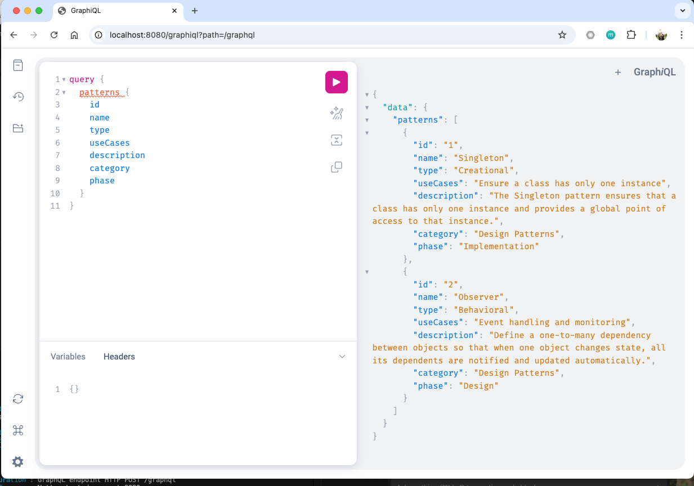

# Spring WebFlux GraphQL Pattern Service

This project demonstrates a reactive Spring Boot application using WebFlux and GraphQL to manage design patterns by HawnSolo.

## Prerequisites

- Java 17 or higher
- Maven 3.6 or higher

## Building the Application

1. Clean and compile the project:
```bash
mvn clean
```

2. Package the application:
```bash
mvn package
```

## Running the Application

You can run the application using either of these methods:

1. Using Maven:
```bash
mvn spring-boot:run
```

2. Using the JAR file:
```bash
java -jar target/pattern-service-1.0.0.jar
```

The application will start on `http://localhost:8080`

## Testing the Application

The GraphQL endpoint is available at: `http://localhost:8080/graphql`
GraphiQL interface is available at: `http://localhost:8080/graphiql`

### Sample GraphQL Queries

1. Get all patterns:
```graphql
query {
  patterns {
    id
    name
    type
    useCases
    description
    category
    phase
  }
}
```

2. Get pattern by ID:
```graphql
query {
  patternById(id: "1") {
    name
    type
    description
  }
}
```

3. Get patterns by category:
```graphql
query {
  patternsByCategory(category: "Design Patterns") {
    name
    type
    phase
  }
}
```

4. Get patterns by phase:
```graphql
query {
  patternsByPhase(phase: "Implementation") {
    name
    type
    category
  }
}
```

### Sample GraphQL Mutation

Create a new pattern:
```graphql
mutation {
  createPattern(
    id: "3"
    name: "Factory Method"
    type: "Creational"
    useCases: "Create objects without specifying exact class"
    description: "Defines an interface for creating objects, but lets subclasses decide which class to instantiate"
    category: "Design Patterns"
    phase: "Implementation"
  ) {
    id
    name
    type
    description
  }
}
```

### Using cURL

1. Query all patterns:
```bash
curl -X POST \
  http://localhost:8080/graphql \
  -H 'Content-Type: application/json' \
  -d '{
    "query": "{ patterns { id name type description } }"
  }'
```

2. Create a new pattern:
```bash
curl -X POST \
  http://localhost:8080/graphql \
  -H 'Content-Type: application/json' \
  -d '{
    "query": "mutation { createPattern(id: \"3\", name: \"Factory Method\", type: \"Creational\", useCases: \"Create objects\", description: \"Factory pattern\", category: \"Design Patterns\", phase: \"Implementation\") { id name type } }"
  }'
```

## GraphiQL Interface Examples

The GraphiQL interface is available at `http://localhost:8080/graphiql`. Here are complete examples you can copy and paste directly into the interface:

### 1. Query All Patterns

In the GraphiQL interface, paste this query:
```graphql
query {
  patterns {
    id
    name
    type
    useCases
    description
    category
    phase
  }
}
```

Expected response:
```json
{
  "data": {
    "patterns": [
      {
        "id": "1",
        "name": "Singleton",
        "type": "Creational",
        "useCases": "Ensure a class has only one instance",
        "description": "The Singleton pattern ensures that a class has only one instance and provides a global point of access to that instance.",
        "category": "Design Patterns",
        "phase": "Implementation"
      },
      {
        "id": "2",
        "name": "Observer",
        "type": "Behavioral",
        "useCases": "Event handling and monitoring",
        "description": "Define a one-to-many dependency between objects so that when one object changes state, all its dependents are notified and updated automatically.",
        "category": "Design Patterns",
        "phase": "Design"
      }
    ]
  }
}
```



### 2. Query Pattern by ID

Query:
```graphql
query {
  patternById(id: "1") {
    id
    name
    type
    useCases
    description
    category
    phase
  }
}
```

Expected response:
```json
{
  "data": {
    "patternById": {
      "id": "1",
      "name": "Singleton",
      "type": "Creational",
      "useCases": "Ensure a class has only one instance",
      "description": "The Singleton pattern ensures that a class has only one instance and provides a global point of access to that instance.",
      "category": "Design Patterns",
      "phase": "Implementation"
    }
  }
}
```

### 3. Query Patterns by Category

Query:
```graphql
query {
  patternsByCategory(category: "Design Patterns") {
    id
    name
    type
    phase
  }
}
```

Expected response:
```json
{
  "data": {
    "patternsByCategory": [
      {
        "id": "1",
        "name": "Singleton",
        "type": "Creational",
        "phase": "Implementation"
      },
      {
        "id": "2",
        "name": "Observer",
        "type": "Behavioral",
        "phase": "Design"
      }
    ]
  }
}
```

### 4. Create New Pattern

Mutation:
```graphql
mutation {
  createPattern(
    id: "3",
    name: "Factory Method",
    type: "Creational",
    useCases: "Create objects without specifying exact class",
    description: "Defines an interface for creating objects, but lets subclasses decide which class to instantiate",
    category: "Design Patterns",
    phase: "Implementation"
  ) {
    id
    name
    type
    useCases
    description
    category
    phase
  }
}
```

Expected response:
```json
{
  "data": {
    "createPattern": {
      "id": "3",
      "name": "Factory Method",
      "type": "Creational",
      "useCases": "Create objects without specifying exact class",
      "description": "Defines an interface for creating objects, but lets subclasses decide which class to instantiate",
      "category": "Design Patterns",
      "phase": "Implementation"
    }
  }
}
```

### 5. Query Patterns by Phase

Query:
```graphql
query {
  patternsByPhase(phase: "Implementation") {
    id
    name
    type
    category
  }
}
```

Expected response:
```json
{
  "data": {
    "patternsByPhase": [
      {
        "id": "1",
        "name": "Singleton",
        "type": "Creational",
        "category": "Design Patterns"
      },
      {
        "id": "3",
        "name": "Factory Method",
        "type": "Creational",
        "category": "Design Patterns"
      }
    ]
  }
}
```

### Tips for Using GraphiQL

1. GraphiQL provides auto-completion: Press Ctrl+Space to see available fields
2. You can format your queries using the "Prettify" button
3. Use the "Docs" explorer on the right side to browse the schema
4. Variables can be defined in the "Query Variables" panel at the bottom

## Sample Response

When querying all patterns, you'll get a response like this:
```json
{
  "data": {
    "patterns": [
      {
        "id": "1",
        "name": "Singleton",
        "type": "Creational",
        "description": "The Singleton pattern ensures that a class has only one instance and provides a global point of access to that instance."
      },
      {
        "id": "2",
        "name": "Observer",
        "type": "Behavioral",
        "description": "Define a one-to-many dependency between objects so that when one object changes state, all its dependents are notified and updated automatically."
      }
    ]
  }
}
